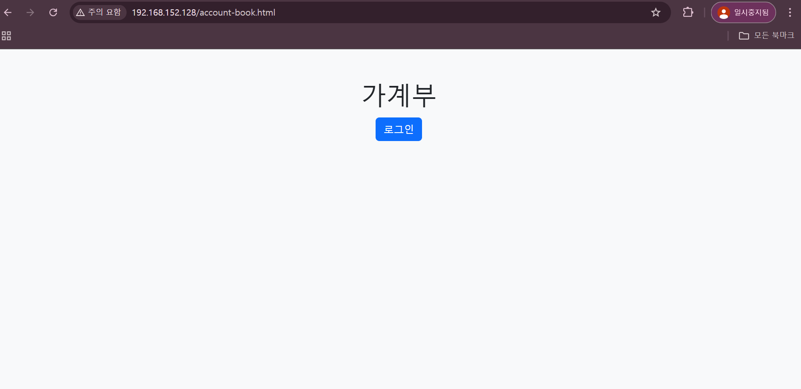
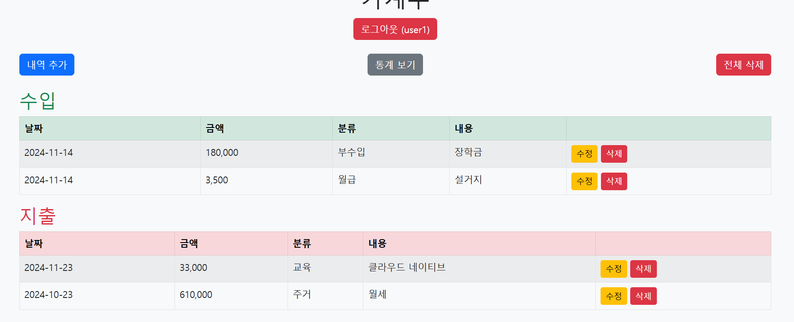

# 클라우드 네이티브 기말 프로젝트

## 프로젝트 주제
일 별로 지출, 수입을 정리할 수 있는 가계부 프로젝트

## 사용 기술
**backend** : Spring boot
 - RESTful API 서버 구현

**frontend** : html, js
 - 정적 웹 페이지 및 동적 화면 구성

**DataBase** : MySQL
 - 데이터 저장 및 관리

**Nginx**
 - 클라이언트 요청을 프론트엔드와, 백엔드로 분배
 - CORS 설정 및 정적파일 제공

**Docker**
 - 각 서비스를 분리하여 컨테이너 기반 환경 구축
 - 도커 컴포즈를 이용한 간단한 배포

## 주요 기능
1. 사용자 로그인 및 세션 관리
    - 로그인, 회원가입 구현
2. 지출/수입 관리
    - 금액, 날짜, 카테고리, 메모 입력
    - 항목 등록, 수정, 삭제
3. 항목 조회
    - 전체 리스트 조회
    - 날짜/ 카테고리별 필터링
4. 통계 보기
    - 월별 지출/수입 요약
    - 카테고리별 비율 그래프
5. 로그인
    - 로그인이 성공해야 메인 화면에 가계부 기능 출력
    - 가계부는 유저별 각각의 데이터로 관리
    - 로그인 성공시 메인화면의 로그인 버튼을 로그아웃 버튼으로 변경

## 도커 허브 및 실행 방법

도커 허브 주소 : https://hub.docker.com/repositories/junbe99

### 실행 방법
도커 컴포즈를 이용하여 실행한다.

**현재 위치하는 디렉토리에 docker-compose.yml 파일이 있어야 한다.**

실행 명령어 : `docker-compose up -d`

종료 명령어 : `docker-compose down`

### 컨테이너 구성
**backend**
- Spring Boot 기반의 서버 컨테이너
- 도커 허브에 업로드 된 빌드된 이미지 사용
- 8080 포트를 사용

**frontend**
- html, js 기반의 클라이언트 컨테이너
- 도커 허브에 업로드 된 빌드된 이미지 사용
- 80 포트를 사용

**nginx-container**
- 공식 nginx 이미지를 기반으로 nginx.conf 파일에 설정을 추가하여 재구성한 컨테이너
- 도커 허브에 업로드 된 빌드된 이미지 사용

**mysql**
- 기본 제공되는 MySQL 이미지 사용
- 3306 포트를 사용

## 구성도

**http://192.168.152.128/**
 - 80 포트를 입력하지 않아도 nginx가 frontend 컨테이너로 접근하게 해준다.

**http://192.168.152.128/api/**
 - 8080 포트를 입력하지 않아도 nginx가 backend 컨테이너로 접근할 수 있도록 한다.

**흐름**
 - 클라이언트가 http://192.168.152.128/account-book.html 에 접속하면 nginx가 frontend 컨테이너에 요청을 보낸다.
 - frontend 컨테이너는 해당 요청에 맞도록 nginx를 통해 backend 컨테이너에 요청을 보낸다.
 - backend 컨테이너는 HTTP 메서드에 맞는 요청을 처리하기 위해 mysql 컨테이너에 접근하여 요청을 처리하고 응답을 보낸다.
 - frontend 컨테이너에서 동적으로 처리된 완성된 화면이 nginx를 통해 client에게 전달되어 완성된 화면이 출력된다.

## 구현 화면
메인 화면

접속 주소 : http://192.168.152.128/account-book.html

**로그인 화면**

**회원 가입**

비밀번호와 비밀번호 확인이 일치하지 않을 경우

정상적으로 가입이 된 경우 (로그인 페이지로 리다이렉트)

**로그인 완료**
- 메인 화면으로 리다이렉트
- 로그인 버튼은 로그아웃 버튼으로 바뀌고 유저 ID가 표시된다.
- 가계부 내역, 추가, 통계 등의 화면이 표시된다.

**내역 추가**

**수정 하기**

**삭제하기**

**통계보기**

- 년,월을 입력하면 해당 년,월에 맞춰서 통계를 보여준다.

**다른 아이디로 로그인**

- 유저별로 각각의 데이터를 보관할 수 있도록 구성

## DB 구조

**account_book 테이블**

- 수입,지출의 데이터를 관리하는 테이블

**user 테이블**

- 유저의 아이디,패스워드를 관리하는 테이블

